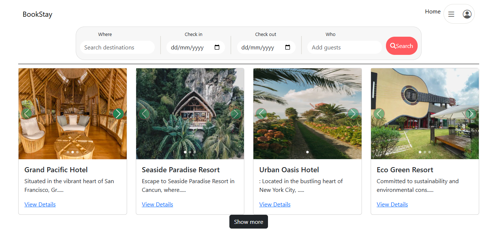
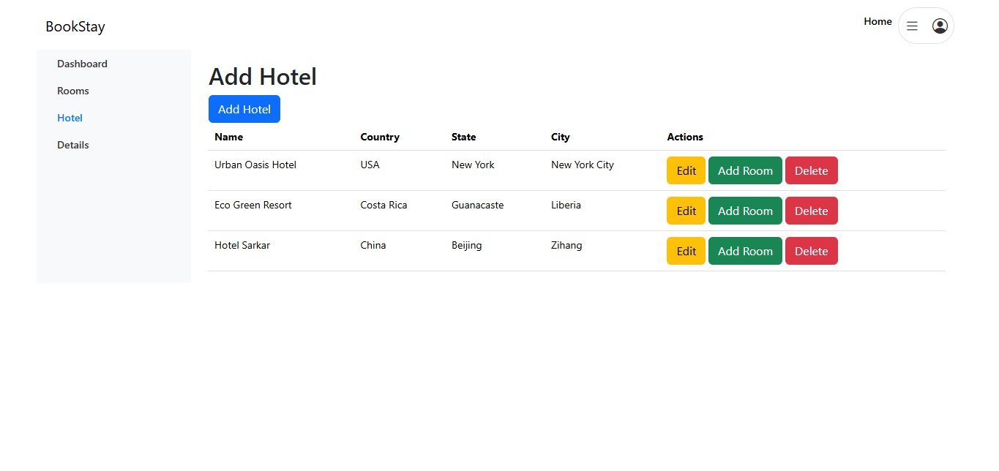

# BookStay
This is a hotel reservation website using html, css, javascript, ejs, node.js and mongodb.

BookStay is a dynamic web application designed to simplify hotel reservations for users. It offers an intuitive interface for users to browse and book hotel rooms, while providing robust hotel management features for administrators. With seamless data handling and an interactive design, BookStay ensures an efficient and user-friendly experience for all.

---

## Features

### User Features:

- **Browse Hotels:** Effortlessly browse through available hotels with details like location, amenities, and pricing.
- **View Hotel Details:** Access detailed information about hotels, including images, facilities, and descriptions.
- **Book Rooms:** Enjoy a seamless booking experience with user-friendly forms.

### Admin/Hotel owner Features:

- **Manage Hotels:** Administrators can add, edit, and delete hotel listings to keep the platform up-to-date.
- **Efficient Hotel Updates:** Make instant updates to hotel details, ensuring accurate and current information for users.

---

## Tech Stack

| Technology      | Purpose                                       |
|------------------|-----------------------------------------------|
| **HTML & CSS**  | Structure and styling of the website (Bootstrap for responsiveness). |
| **JavaScript**  | Dynamic interactivity and client-side logic.   |
| **EJS**         | Templating engine for rendering dynamic views. |
| **Node.js**     | Server-side JavaScript runtime.               |
| **Express.js**  | Web framework for handling routes and APIs.   |
| **MongoDB**     | Database for storing hotels, users, and bookings. |

---

## Screenshots

### Homepage



### Hotel Details Page


### Admin/Hotel owner Panel



---

## Installation and Setup

Follow the steps below to run the project locally:

1. **Clone the Repository:**

    ```bash
    git clone https://github.com/sudhirKsah/BookStay-Hotel-Reservation
    cd BookStay-Hotel-Reservation
    ```

2. **Install Dependencies:**

    ```bash
    cd backend
    npm install
    ```

3. **Configure Environment Variables:**

    - Create a `.env` file in the ```backend``` directory.
    - Add the following variables:

        ```env
        PORT=5000
        MONGODB_URI=your-mongodb-connection-string
        SECRET=your-jwt-secret
        ```

4. **Run the Application:**

    ```bash
    npm start
    ```

5. **Access the Application:**

    - Open your browser and navigate to: `http://localhost:5000`

---